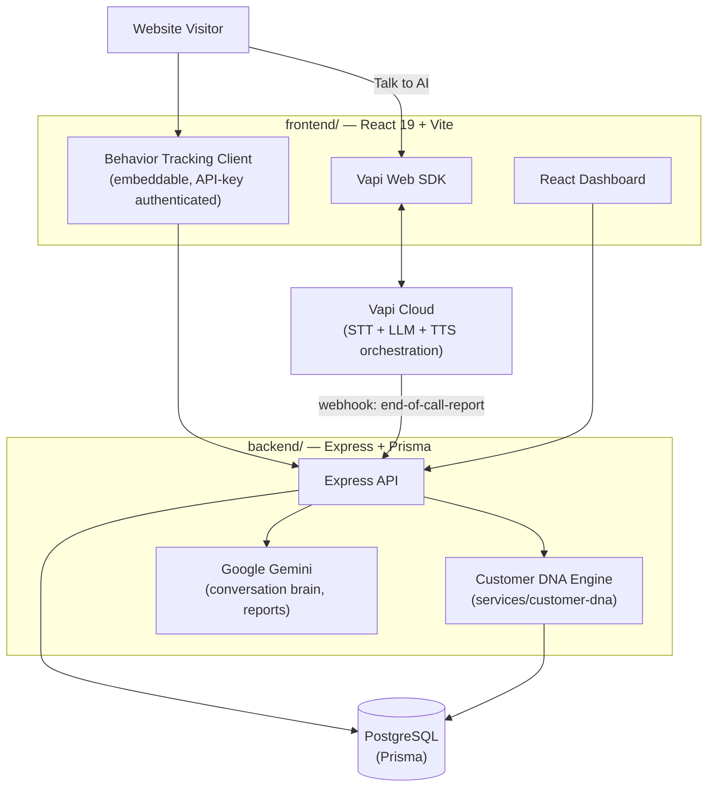

<div align="center">

<!-- Banner placeholder — replace with a real 1280x640 product banner (docs/banner.png) -->


# Nexora AI

**Enterprise AI Sales Intelligence Platform powered by Voice AI & Customer DNA Intelligence.**

[](https://react.dev)
[](https://vitejs.dev)
[](https://nodejs.org)
[](https://expressjs.com)
[](https://www.postgresql.org)
[](https://vapi.ai)
[](https://ai.google.dev)
[](#license)

[Live Demo](#) · [Documentation](docs/INSTALLATION.md) · [Report a Bug](#) · [Request a Feature](#)

</div>

---

## Table of Contents

- [Overview](#overview)
- [Features](#features)
- [Architecture](#architecture)
- [Tech Stack](#tech-stack)
- [Screenshots](#screenshots)
- [Folder Structure](#folder-structure)
- [Getting Started](#getting-started)
- [Environment Variables](#environment-variables)
- [Available Scripts](#available-scripts)
- [Deployment](#deployment)
- [Roadmap](#roadmap)
- [Contributing](#contributing)
- [License](#license)

---

## Overview

Most "AI sales chatbots" open a conversation cold, asking generic discovery questions the visitor has already answered with their own behavior. Nexora AI does the opposite:

1. **Watches behavior first** — pages visited, dwell time, scroll depth, clicks, pricing/enterprise page visits, search terms, case studies viewed.
2. **Builds a Customer DNA profile** from that behavior and every conversation — buying intent, personality, communication style, budget level, pain points, objections, and a lead grade — deterministically scored and fully explainable, not a black box.
3. **Starts the conversation already informed**, live, by voice — not "Hello, how can I help you?" but a real opening grounded in what the visitor actually did on the site.
4. **Reasons after every turn**, tracks live signals (interest, trust, buying probability), and produces a structured post-call sales report with a CRM-ready summary.

This is a full-stack, multi-tenant SaaS product — not a single-page demo — with authentication, a production dashboard, real-time voice orchestration, and its own analytics layer.

## Features

### 🎙️ Voice AI Sales Consultant
Live, real-time voice conversations powered by [Vapi](https://vapi.ai) — natural turn-taking, instant interruption handling, sub-second response latency, and support for both **English and Hindi**, selectable per call and persisted across sessions.

### 🧬 Customer DNA Engine
A dedicated, independent intelligence module that turns raw website behavior and conversation transcripts into a structured profile: four core scores (interest, trust, engagement, buying probability), a lead grade (A+ through D), one of seven personality archetypes, communication style, pain points, objections, and concrete next-best-action recommendations — computed deterministically, with zero LLM calls, so every result is traceable back to real data.

### 📊 Real-Time Analytics Dashboard
Live KPIs, visitor trend charts, a sales funnel, per-visitor timelines, and a leads table — all backed by a validated, colorblind-safe dataviz palette.

### 🎯 Lead Intelligence
Structured lead capture during every conversation (name, email, company, budget, timeline, decision-maker status), automatic lead scoring, and a dedicated leads pipeline view.

### 📝 Post-Call Sales Reports
Every call ends with an AI-generated transcript summary, performance score, missed opportunities, follow-up plan, and CRM-ready summary.

### 🔐 Multi-Tenant, Production-Grade Backend
Organization-scoped data isolation, JWT + API-key authentication, Zod-validated inputs, rate limiting, structured logging, and graceful shutdown handling.

## Architecture



**Data flow, end to end:** a visitor's behavior is tracked client-side and sent to the API; when they start a voice call, the browser talks directly to Vapi's cloud (which owns speech-to-text, the LLM turn, and text-to-speech), and Vapi calls back to our webhook once the call ends. The Customer DNA Engine then reads the accumulated behavior events, transcript, and lead data — from the *same* database tables the voice pipeline and tracker already wrote to — and produces a scored profile without ever calling into the voice pipeline directly. The dashboard reads everything through the same authenticated REST API a real integration partner would use.

## Tech Stack

| Layer | Technologies |
|---|---|
| **Frontend** | React 19, Vite 6, React Router, Tailwind CSS, Framer Motion, Zustand, React Hook Form + Zod, Recharts, Axios, Lucide Icons |
| **Backend** | Node.js, Express, Socket.IO, JWT, Zod, Pino (structured logging) |
| **Database** | PostgreSQL, Prisma ORM |
| **Voice AI** | [Vapi](https://vapi.ai) (call orchestration, STT + TTS), browser WebRTC |
| **LLM** | Google Gemini via LangChain (`@langchain/google-genai`) |
| **Auth** | JWT (access + httpOnly refresh cookie), scoped API keys for public tracking endpoints |

## Screenshots

<!-- Replace with real screenshots — recommended: docs/screenshots/{landing,dashboard,voice-call,customer-dna}.png -->

| Landing Page | Dashboard |
|---|---|
| _placeholder — add `docs/screenshots/landing.png`_ | _placeholder — add `docs/screenshots/dashboard.png`_ |

| Voice AI Call | Customer DNA |
|---|---|
| _placeholder — add `docs/screenshots/voice-call.png`_ | _placeholder — add `docs/screenshots/customer-dna.png`_ |

## Folder Structure

```
Nexora-AI/
├── frontend/                        # React 19 + Vite SaaS application
│   ├── public/                      # favicon, static assets
│   ├── src/
│   │   ├── api/                     # axios instance + interceptors
│   │   ├── components/
│   │   │   ├── common/              # Button, Badge, GlassCard, CircularScore, Logo, ...
│   │   │   ├── layout/              # Sidebar, Topbar (dashboard shell)
│   │   │   ├── voice/                # Waveform, AIAvatar, VoiceStatusIndicator, LanguageSelect
│   │   │   ├── dna/                  # Customer DNA panel
│   │   │   ├── dashboard/            # VisitorsTable and other dashboard widgets
│   │   │   ├── analytics/            # charts (trend, funnel, category)
│   │   │   └── ...                   # marketing-site components (Hero, CTA, Navbar, Footer, ...)
│   │   ├── hooks/                    # useVoiceCall, usePublicVoiceCall, useBehaviorTracking, ...
│   │   ├── layouts/                  # MarketingLayout, DashboardLayout, AuthLayout
│   │   ├── pages/                    # route-level pages (marketing site + dashboard)
│   │   ├── routes/                   # ProtectedRoute and route guards
│   │   ├── services/                 # feature-level API clients (voice, tracking, leads, ...)
│   │   ├── store/                    # Zustand stores (auth, conversation, toast)
│   │   ├── styles/                   # design tokens (variables.css) + Tailwind entry
│   │   ├── data/                     # static marketing content (services, pricing, FAQ, ...)
│   │   └── App.jsx / main.jsx
│   └── package.json
│
├── backend/                          # Express API + AI services
│   ├── prisma/
│   │   ├── schema.prisma             # full multi-tenant data model
│   │   └── migrations/
│   ├── src/
│   │   ├── ai/
│   │   │   ├── behaviorEngine/       # heuristic behavior scoring
│   │   │   ├── customerDNA/          # legacy LLM-generated DNA (voice-call context)
│   │   │   ├── conversationBrain/    # per-turn reasoning + prompts
│   │   │   └── strategyEngine/       # sales strategy / objection playbook
│   │   ├── services/
│   │   │   ├── customer-dna/         # independent Customer DNA Engine (deterministic scoring)
│   │   │   ├── behavior/             # event ingestion + aggregation
│   │   │   ├── voice/                # Vapi webhook handling
│   │   │   └── ...                   # leadService, analyticsService, recommendationService
│   │   ├── controllers/ · routes/ · validators/  # REST API layer
│   │   ├── middleware/               # auth, rate limiting, error handling
│   │   ├── config/                   # env, db, Gemini, Vapi client config
│   │   └── app.js / server.js
│   └── package.json
│
├── docs/
│   └── INSTALLATION.md
├── package.json                      # npm workspaces root
└── README.md
```

## Getting Started

New to this repo? [`docs/INSTALLATION.md`](docs/INSTALLATION.md) is the complete, detailed walkthrough (prerequisites, where to get each API key, production deployment, troubleshooting). The steps below are the same flow, condensed — enough to go from a fresh clone to a running app.

**1. Install dependencies** (root, `frontend/`, and `backend/` in one pass — npm workspaces):

```bash
npm install
```

**2. Set up your env files** — copy each example and fill in real values (see [Environment Variables](#environment-variables) below, or [`docs/INSTALLATION.md`](docs/INSTALLATION.md#3-configure-environment-variables) for exactly what each key is and where to get it):

```bash
cp backend/.env.example backend/.env
cp frontend/.env.example frontend/.env
```

**3. Create the database tables** (requires `DATABASE_URL` in `backend/.env` to already point at a real Postgres instance — a free [Neon](https://neon.tech) project works fine):

```bash
npm run prisma:generate
npm run prisma:migrate
```

**4. Run it:**

```bash
npm run dev
```

- Frontend: http://localhost:5173
- Backend API: http://localhost:5000

At this point the site, dashboard, and login all work. The one thing that *won't* work yet is the voice AI saving anything after a call — that needs one more step:

**5. Wire up the voice AI's webhook (one-time):** Vapi's cloud calls your backend to deliver the end-of-call transcript, scores, and lead data once a voice call ends — `localhost` isn't reachable from Vapi's side, so it needs a public URL. In local dev, expose your backend with a tunnel (e.g. `npx cloudflared tunnel --url http://localhost:5000`, no account needed — or `ngrok http 5000` if you already have an ngrok account), copy the `https://...` URL it prints, set it as `VAPI_WEBHOOK_BASE_URL` in `backend/.env`, then run:

```bash
npm run vapi:configure --workspace=backend
```

Without this, voice calls still connect and the AI still talks — but nothing after the call (report, lead capture, admin dashboard data) is ever saved. Re-run this command any time your tunnel URL changes (a free tunnel's URL is temporary — it changes every time you restart it). For a permanent fix, point `VAPI_WEBHOOK_BASE_URL` at your real deployed backend URL (see [Deployment](#deployment)) instead of a tunnel, and run the command once more.

## Environment Variables

Two env files are required — copy each from its `.env.example`:

- **`backend/.env`** — database connection, JWT secrets, Google Gemini API key, Vapi API keys (private + webhook secret), CORS origins, rate limits.
- **`frontend/.env`** — API base URL, Vapi public key, tracking API key.

No secrets are committed to the repository. See each `.env.example` for the full annotated list.

## Available Scripts

Run from the repo root (npm workspaces):

| Script | Description |
|---|---|
| `npm run dev` | Run frontend + backend concurrently |
| `npm run dev:frontend` | Run only the frontend dev server |
| `npm run dev:backend` | Run only the backend dev server (nodemon) |
| `npm run build` | Build the frontend for production |
| `npm run start:backend` | Start the backend in production mode |
| `npm run lint` | Lint both workspaces |
| `npm run prisma:generate` | Generate the Prisma client |
| `npm run prisma:migrate` | Run Prisma migrations (dev) |
| `npm run prisma:studio` | Open Prisma Studio |
| `npm run vapi:configure --workspace=backend` | One-time: points the Vapi Assistant's webhook at this backend (requires `VAPI_WEBHOOK_BASE_URL`) — re-run whenever that URL changes |

## Deployment

| Layer | Suggested Provider | Notes |
|---|---|---|
| Frontend | Vercel | Root directory `frontend/`, build command `npm run build`, output `dist` |
| Backend | Render | Root directory `backend/`, start command `npm start`; requires a publicly reachable URL for the Vapi webhook |
| Database | Neon / any managed PostgreSQL | Connection string goes into `DATABASE_URL` |

Full deployment steps are in [`docs/INSTALLATION.md`](docs/INSTALLATION.md).

## Roadmap

- [x] Multi-tenant auth, dashboard shell, behavior tracking pipeline
- [x] Customer DNA — qualitative (LLM, per voice call) and the independent deterministic Customer DNA Engine
- [x] Real-time voice AI via Vapi, with English/Hindi language switching
- [x] Analytics dashboard, lead pipeline, post-call sales reports
- [x] Marketing site (services, pricing, industries, case studies, about, blog)
- [ ] Live, in-call tool-calling for the voice AI (currently: full context in, structured results out at call end)
- [ ] Wire the dashboard's Customer DNA panel to the new Customer DNA Engine's richer output (lead grade, recommendations, confidence)
- [ ] Screenshot/demo video assets
- [ ] Public API documentation

## Contributing

This is currently a solo/private project, but contributions and suggestions are welcome:

1. Fork the repository and create a feature branch (`git checkout -b feature/your-feature`).
2. Make your changes — run `npm run lint` before committing.
3. Commit with a clear, descriptive message.
4. Open a pull request describing what changed and why.


## License

This project does not currently have an open-source license attached — all rights reserved by default. If you intend to open-source it, add a `LICENSE` file (MIT is a common choice for projects like this) and update this section accordingly.

---

<div align="center">

Built with ⚡ by the Nexora AI team.

</div>
